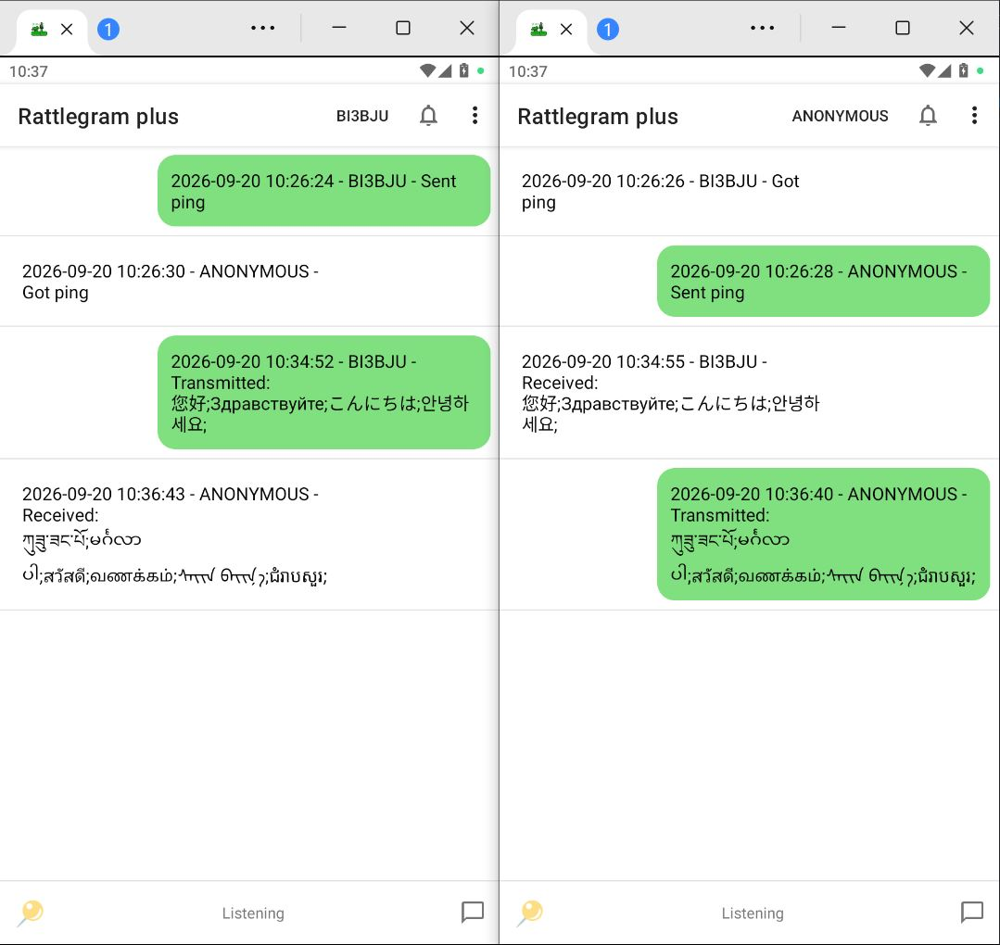

Rattlegram Plus

[]

## Screenshots (截图)

| 主界面 (Main) | 
| :---: |
|  | 

Rattlegram Plus 是一款利用音频调制/解调实现短距离文本通信的 Android 应用。它能将文本信息编码为可听或超声波音频信号，并通过麦克风接收解码，无需 Wi‑Fi、蓝牙或蜂窝网络即可实现点对点消息传递。

本项目是原版 Rattlegram 的增强版，增加了端到端加密、位置共享、循环信标和现代 Material Design 界面。

功能特点
📡 基于音频的消息收发 – 通过扬声器和麦克风传输文字。

🔐 端到端加密 – 可选的密码式 AES 加密（256 位），保护隐私。

📍 位置共享 – 分享您的 GPS 坐标，接收方可在地图应用中打开。

🔁 中继模式 – 自动转发收到的消息（可配置防震和延迟）。

📶 频谱分析仪 – 实时 FFT 和瀑布图显示，用于信号调试。

🕊️ 循环信标 – 定时发送空消息（Ping），用于存在性检测。

🎚️ 灵活音频设置 – 采样率、声道选择、音频源、载波频率、噪声符号。

🌙 夜间模式 – 深色主题。

📨 消息历史 – 持久存储，发送/接收气泡显示。

🗺️ 地图集成 – 点击接收到的位置消息，可在 All‑In‑One Offline Maps（或系统选择器）中打开。

工作原理
应用使用原生 C++ 库（librattlegram.so）进行 FSK 调制解调。文本消息被封装成音频帧，通过扬声器播放，麦克风接收后由解码器同步并提取原始数据。

编码器 – 将消息打包为带帧头 + 有效载荷的结构，添加纠错符号，生成 PCM 音频采样。

解码器 – 持续分析麦克风输入，检测前导码，同步并提取数据。

加密 – 启用时，消息在编码前加密，解码后使用配置的密码解密。

安装
从 Releases 页面下载最新 APK。

在 Android 设置中启用 安装未知来源应用。

安装并启动应用。

根据提示授予麦克风和位置权限。

⚠️ 应用要求 Android 5.0 (API 21) 或更高版本。

从源码构建
克隆仓库：

bash
git clone https://github.com/BI3BJU/rattlegram-plus.git
cd rattlegram-plus
在 Android Studio（Arctic Fox 或更新版本）中打开项目。

构建原生库（使用 CMake）：

JNI 源码位于 app/src/main/cpp/。

请通过 SDK Manager 安装 NDK 和 CMake。

在设备或模拟器上构建并运行应用。

使用指南
🗣️ 发送消息
点击右下角的撰写按钮（📝）。

输入文本（最多 170 字节）。

可选勾选加密（需要先在菜单中设置密码）。

点击发送 – 音频播放，消息显示为“已发送”。

📍 共享位置
点击左下角的位置按钮（📍）。

授予位置权限（如果尚未授予）。

应用会获取最后已知的 GPS/网络位置，并自动在撰写对话框填入 [LOC] geo:lat,lng 字符串。

像普通消息一样发送即可。

🔁 中继模式
从菜单启用：启用中继模式。

收到消息后，会经过配置的延迟后自动转发。

防震机制可防止在设定时间内重复转发同一条消息。

📶 频谱分析仪
从菜单中选择 显示频谱。

弹出对话框显示实时 FFT（频谱）和瀑布图（声谱图）。

有助于微调载波频率或检查信号质量。

🔐 设置密码
打开菜单 → 密码。

输入密码（8–256 字节）或点击生成创建安全的十六进制字符串。

设置后，您可以加密发送的消息；接收到的加密消息会自动解密。

🕊️ 循环信标
从菜单点击 Ping – 应用将每分钟发送一次空消息。

再次点击停止。

🗺️ 打开接收到的位置
点击任何以 [LOC] geo: 开头的接收消息。

系统将询问使用哪个地图应用（优先使用 All‑In‑One Offline Maps）。

权限
RECORD_AUDIO – 麦克风访问权限。

ACCESS_FINE_LOCATION – GPS 位置共享权限。

（可选）POST_NOTIFICATIONS – 未使用，但可能在新版 Android 上显示。

配置选项（菜单）
选项	说明
输出/录制采样率	8、16、32、44.1、48 kHz
声道选择	单声道 / 立体声 / 左 / 右 / 和 / 解析
音频源	默认、麦克风、摄像机、语音识别、未处理
载波频率	1000 Hz – (采样率/2 – 带宽)
噪声符号	添加额外 FEC 符号（0–22）
中继延迟	0–8 秒
中继防震	0–120 秒（防止回声循环）
高级帧头	使用更长的前导码以提高同步性
夜间模式	开启/关闭
删除消息	清空历史记录
强制退出	完全退出应用
依赖库
AndroidX – 现代 UI 组件和兼容性。

原生 C++ 库 – 自定义 FSK 调制解调器（未包含在此代码中）。

无外部 GMS / Play 服务 – 位置仅使用 Android 内置 LocationManager。

贡献
欢迎贡献！请提交 Issue 或 Pull Request。

使用 GitHub issue 追踪器 报告错误或提出新功能。

遵循现有源码的代码风格。

许可证
本项目采用 MIT 许可证 – 详见 LICENSE 文件。

致谢
原版 Rattlegram 由 Tom Van Braeckel 开发。

Rattlegram Plus 由 BI3BJU (guerilla1949@gmail.com) 维护。

免责声明
本应用按“原样”提供，仅供实验和教育用途。作者不对因使用本软件造成的任何误用或损害负责。

Rattlegram Plus
https://img.shields.io/badge/License-MIT-blue.svg
https://img.shields.io/badge/platform-Android-green.svg
https://img.shields.io/badge/API-21%252B-brightgreen.svg
https://img.shields.io/badge/JNI-C%252B%252B-orange.svg

Rattlegram Plus is an Android application that enables short-range text communication using audio modulation/demodulation. It encodes text messages into audible or ultrasonic audio signals and decodes them from the microphone, allowing peer-to-peer messaging without Wi‑Fi, Bluetooth, or cellular networks.

This project is a continuation of the original Rattlegram, enhanced with end‑to‑end encryption, location sharing, cyclic beacon, and a modern Material Design interface.

Features
📡 Audio‑based messaging – transmit and receive text over sound (speaker & microphone).

🔐 End‑to‑end encryption – optional password‑based AES encryption (256‑bit) for privacy.

📍 Location sharing – share your GPS coordinates; recipients can open them in any map app.

🔁 Repeater mode – automatically repeat received messages (with debounce and delay).

📶 Spectrum analyzer – real‑time FFT and waterfall display for signal tuning.

🕊️ Cyclic beacon – periodic transmission of a ping (empty message) for presence detection.

🎚️ Flexible audio settings – sample rates, channel selection, audio source, carrier frequency, noise symbols.

🌙 Night mode – dark theme support.

📨 Message history – stored persistently with sent/received bubbles.

🗺️ Map integration – tap a received location message to open in All‑In‑One Offline Maps (or system picker).

How It Works
The app uses a native C++ library (librattlegram.so) to perform FSK‑based modulation and demodulation. Text messages are converted to audio frames, played through the speaker, and received via the microphone. The decoder synchronises to the incoming signal, extracts the payload, and displays it.

Encoder – packs your message into a structured frame (header + payload), adds error correction symbols, and generates PCM audio samples.

Decoder – continuously analyses microphone input, detects preamble, synchronises, and extracts the original data.

Encryption – when enabled, the message is encrypted before encoding and decrypted after decoding using the configured password.

Installation
Download the latest APK from the Releases page.

Enable Install from unknown sources in your Android settings.

Install and launch the app.

Grant microphone and location permissions when prompted.

⚠️ The app requires Android 5.0 (API 21) or higher.

Building from Source
Clone the repository:

bash
git clone https://github.com/BI3BJU/rattlegram-plus.git
cd rattlegram-plus
Open the project in Android Studio (Arctic Fox or later).

Build the native library (CMake is used):

The JNI source is located under app/src/main/cpp/.

Ensure you have the NDK and CMake installed via SDK Manager.

Build and run the app on your device or emulator.

Usage Guide
🗣️ Sending a Message
Tap the compose button (📝) at the bottom right.

Type your text (up to 170 bytes).

Optionally check Encrypt (requires a password set in the menu).

Tap Transmit – the audio will play and the message will appear as “sent”.

📍 Sharing Your Location
Tap the location button (📍) at the bottom left.

Grant location permission if not already.

The app will fetch the last known GPS/network location and pre‑fill the compose dialog with a [LOC] geo:lat,lng string.

Send it like a normal message.

🔁 Repeater Mode
Enable from the menu: Enable repeater mode.

When a message is received, it will be retransmitted automatically after a configurable delay.

Debounce prevents repeated retransmission of the same message within a set time.

📶 Spectrum Analyzer
From the menu, select Show spectrum.

A dialog appears showing real‑time FFT (frequency spectrum) and a waterfall (spectrogram).

Useful for fine‑tuning carrier frequency or checking signal quality.

🔐 Setting a Password
Open the menu → Password.

Enter a password (8–256 bytes) or tap Generate to create a secure hex string.

Once set, you can encrypt outgoing messages; incoming encrypted messages will be decrypted automatically.

🕊️ Cyclic Beacon
From the menu, tap Ping – the app will send an empty message every minute.

Tap again to stop.

🗺️ Opening a Received Location
Tap any received message that starts with [LOC] geo:.

The system will ask which map application to use (All‑In‑One Offline Maps is preferred).

Permissions
RECORD_AUDIO – required for microphone access.

ACCESS_FINE_LOCATION – required for GPS location sharing.

(Optional) POST_NOTIFICATIONS – not used, but may appear on newer Android versions.

Configuration Options (Menu)
Option	Description
Output / Record sample rate	8, 16, 32, 44.1, 48 kHz
Channel selection	Mono / Stereo / Left / Right / Sum / Analytic
Audio source	Default, Mic, Camcorder, Voice Recognition, Unprocessed
Carrier frequency	1000 Hz – (sample rate/2 – bandwidth)
Noise symbols	Adds extra FEC symbols (0–22)
Repeater delay	0–8 seconds
Repeater debounce	0–120 seconds (prevents echo loops)
Fancy header	Uses a longer preamble for better sync
Night mode	On / Off
Delete messages	Clears history
Force quit	Exits the app completely
Libraries & Dependencies
AndroidX – modern UI components and compatibility.

Native C++ library – custom FSK modem (not included here).

No external GMS / Play Services – location uses only Android’s built‑in LocationManager.

Contributing
Contributions are welcome! Please open an issue or submit a pull request.

Use the GitHub issue tracker for bugs and feature requests.

Follow the code style of the existing source.

License
This project is licensed under the MIT License – see the LICENSE file for details.

Credits
Original Rattlegram by Tom Van Braeckel.

Rattlegram Plus maintained by BI3BJU (guerilla1949@gmail.com).

Disclaimer
This app is provided as‑is for experimental and educational purposes. The author is not responsible for any misuse or damage caused by this software.

